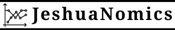

# Prefacio {-}

```{r, echo = F}
options(knitr.duplicate.label = "allow")
```

```{r, child="_setup.Rmd"}
```

```{r, eval=my_output == "html", echo=FALSE, results='asis'}
cat('<hr style="background-color:#03193b;height:2px">')
```

<center></center>

```{r, eval=my_output == "html", echo=FALSE, results='asis'}
cat('<hr style="background-color:#03193b;height:2px">')
```

<center></center>
<br><center></center>
<br><center><a href="https://www.jeshuanomics.com/" target="blank">Publicado por Jeshua Romero Guadarrama en colaboración con JeshuaNomics:</a></center>
<br><center><a href="https://github.com/JeshuaNomics" class="fa fa-github"><span class="label">  Git Hub</span></a>
<a href="https://www.facebook.com/JeshuaNomics/" class="fa fa-facebook"><span class="label">  Facebook</span></a>
<a href="https://twitter.com/JeshuaNomics" class="fa fa-twitter"><span class="label">  Twitter</span></a>
<a href="https://www.linkedin.com/in/jeshua-romero-guadarrama/" class="fa fa-linkedin"><span class="label">  Linkedin</span></a>
<a href="https://vk.com/jeshuanomics" class="fa fa-vk"><span class="label">  Vkontakte</span></a>
<a href="https://jeshuanomics.tumblr.com/" class="fa fa-tumblr"><span class="label">  Tumblr</span></a>
<a href="https://www.youtube.com/channel/UCY7f84mJGvMN7TF7XI4-Jgg?view_as=subscriber/" class="fa fa-youtube-play"><span class="label">  YouTube</span></a>
<a href="https://www.instagram.com/JeshuaNomics/" class="fa fa-instagram"><span class="label">  Instagram</span></a></center>

<br> Jeshua Romero Guadarrama es economista y actuario por la <a href="http://www.economia.unam.mx/">Universidad Nacional Autónoma de México</a>, quien ha construido el presente proyecto en colaboración con <a href="https://www.jeshuanomics.com">JeshuaNomics</a>, ubicado en la Ciudad de México, se puede contactar mediante el siguiente correo electrónico: jeshuanomics@gmail.com.
<br>
<br> `r sf <- lubridate::stamp_date('Última actualización el martes 21 del 05 de 2021'); sf(Sys.Date())`
<br>

```{r, eval=knitr::opts_knit$get("rmarkdown.pandoc.to") == "html", results='asis', echo=FALSE}
cat('<hr style="background-color:#03193b;height:2px">')
```

Los estudiantes con poca experiencia en estadística y econometría a menudo tienen dificultades para entender los beneficios de desarrollar habilidades de programación al momento de aplicar diversos métodos econométricos. <i>CienciaPolitica: Econometría avanzada y ciencia de datos con R</i> por Jeshua Romero Guadarrama (2021), ofrece una introducción interactiva a los aspectos esenciales de la programación por medio del lenguaje y software estadístico R, así como una guía para la aplicación de la teoría económica y econométrica en entornos específicos. En otras palabras, el objetivo es que los estudiantes se adentren al mundo de la economía aplicada mediante ejemplos empíricos presentados en la vida diaria y haciendo uso de las habilidades de programación recién adquiridas. Dicho objetivo se encuentra respaldado por ejercicios de programación interactivos generados con DataCamp Light y la incorporación de visualizaciones dinámicas de conceptos fundamentales mediante la flexibilidad de JavaScript, a través de la biblioteca D3.js.

En los últimos años, el lenguaje de programación estadística R se ha convertido en una parte integral del plan de estudios de las clases de econometría que se imparten en las universidades. Regularmente una gran parte de los estudiantes no han estado expuestos a ningún lenguaje de programación antes y, por lo tanto, tienen dificultades para participar en el aprendizaje de R por sí mismos. Con poca experiencia en estadística y econometría, es natural que los novicios tengan dificultades para comprender los beneficios de desarrollar habilidades en R para aprender y aplicar la econometría. Estos incluyen particularmente la capacidad de realizar, documentar y comunicar estudios empíricos y tener las facilidades para programar estudios de simulación, lo cual es útil para, por ejemplo, comprender y validar teoremas que generalmente no se asimilan o entienden fácilmente con el estudio de las fórmulas. Al ser un economistas aplicado y econometrista, me gustaría que mis colegas desarrollen capacidades de gran valor; en consecuencia, deseo compartir con las nuevas generaciones de economistas mis conocimientos.

En lugar de confrontar a los estudiantes con ejercicios de codificación puros y literatura clásica complementaria, he pensado que sería mejor proporcionar material de aprendizaje interactivo que combine el código en R con el contenido del curso de texto *Introducción a la Econometría* de @stock2015 que sirve de base para el presente material. El presente trabajo es un complemento empírico interactivo al estilo de un informe de investigación reproducible que permite a los estudiantes no solo aprender cómo los resultados de los estudios de casos se pueden replicar con R, sino que también fortalece su capacidad para utilizar las habilidades recién adquiridas en otras aplicaciones empíricas.

#### Las convenciones usadas en el presente curso {-}

+ El texto *en cursiva* indica nuevos términos, nombres, botones y similares.

+ El texto **en negrita** se usa generalmente en párrafos para referirse al código **R**. Esto incluye comandos, variables, funciones, tipos de datos, bases de datos y nombres de archivos.

+ <code>Texto de ancho constante sobre fondo gris</code> indica un código **R** que usted puede escribir literalmente. Puede aparecer en párrafos para una mejor distinción entre declaraciones de código ejecutables y no ejecutables, pero se encontrará principalmente en forma de grandes bloques de código **R**. Estos bloques se denominan fragmentos de código.

#### Reconocimiento {-}

A mi alma máter: Universidad Nacional Autónoma de México. Facultad de Economía. Por brindarme valiosas oportunidades que coadyuvaron a mi formación.

```{r, eval=knitr::opts_knit$get("rmarkdown.pandoc.to") == "html", results='asis', echo=FALSE}
cat('<br>


Esta obra está autorizado bajo la [Creative Commons Attribution-NonCommercial-ShareAlike 4.0 International License](http://creativecommons.org/licenses/by-nc-sa/4.0/).')
```


ÍNDICE SUMARIO DE SUS CONTENIDOS:

Capítulo 1: LA TEORÍA POLÍTICA

a) Consideraciones generales: La teoría científica social - Cuestiones metodológicas - Principios actuales - Críticas a la ciencia.

b) Fases de la actividad científica: Teorías representativas y normativas - Descripción - Explicación - Generalización - Teoría - Cuasi-teorías: clasificaciones, dicotomías y analogías.

c) La evaluación del fenómeno político: Ciencia y valoración - Los componentes del juicio normativo: descripción, evaluación técnica, juicio normativo, justificación del juicio normativo.

d) El concepto teórico político - Comparaciones con otras ciencias: Teoría y Filosofía Política - Ciencia Política como disciplina autónoma - Teoría Política e Historia de las Ideas - Teorías generales y de alcance medio - Dificultades para la elaboración teórica.

Capítulo 2: LAS TEORIAS NORMATIVAS

a) Rasgos generales: Condiciones históricas y trasfondos ideológicos - Clasificación de las teorías normativas - Raíces intelectuales - Fundamentos - Finalidad- Relaciones - Metodología.

b) Teorías políticas normativas clásicas: chinas, hindúes, judías, islámicas, griegas, romanas, medievales y modernas.

c) Teorías políticas normativas contemporáneas: El asalto al absolutismo - Las consecuencias de la Revolución Francesa - Socialismos y nacionalismos - Las teorías normativas actuales.

d) Enfoques metodológicos usuales: Métodos: histórico, analógico, práctico, tópico, pedagógico. El pragmatismo metodológico.

Capítulo 3: LAS TEORIAS EMPIRICO-ANALITICAS

a) Rasgos generales: El positivismo, el empirismo y sus derivados - El objeto y el método - Problemas actuales.

b) Behaviorismo, estructural-funcionalismo y enfoque sistémico. El enfoque comparatista: Descripción de los enfoques - Síntesis de obras teóricas de estas corrientes.

c) Las explicaciones de base psicológica individual: La Psicología del estímulo-respuesta - La Psicología de la Gestalt - La Teoría del Campo - El freudismo ortodoxo - El neofreudismo.

d) El Formalismo - La Teoría de los Juegos - La Teoría de la Información y la Cibernética - Modelos y simulaciones.

e) Enfoques metodológicos usuales: Puntos en común - Particularidades metodológicas - Reflexiones sobre el lenguaje y la elaboración conceptual.

Capítulo 4: LAS TEORIAS CRITICO-DIALECTICAS Introducción general: Repercusiones del tema - Aportes perdurables del marxismo.

a) El marxismo clásico. Rasgos generales: Marx y Engels - Conte- nidos del marxismo - Primera y segunda generación de sucesores.

b) El marxismo occidental: La Escuela de Frankfurt - Otros intelectuales europeos marxistas -Intelectuales norteamericanos marxistas - La Nueva Izquierda.

c) La labor teórica en los países socialistas europeos.

d) Las teorías crítico-dialécticas en los países del tercer mundo: El maoísmo y sus derivados asiáticos -El socialismo africano- El marxismo latinoamericano: Justo, Mariátegui y Haya de la Torre; la Nueva Izquierda latinoamericana, el castrismo, el sandinismo, el allendismo chileno. Relaciones de estas teorías con la Teología de la Liberación.

e) Enfoques metodológicos usuales: Materialismo dialéctico y materialismo histórico - Teoría y praxis - Otros aportes metodológicos. 